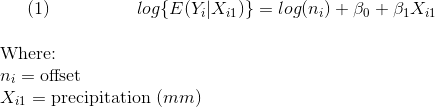
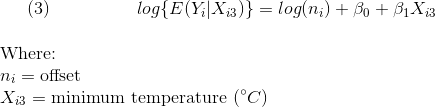
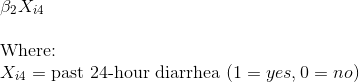
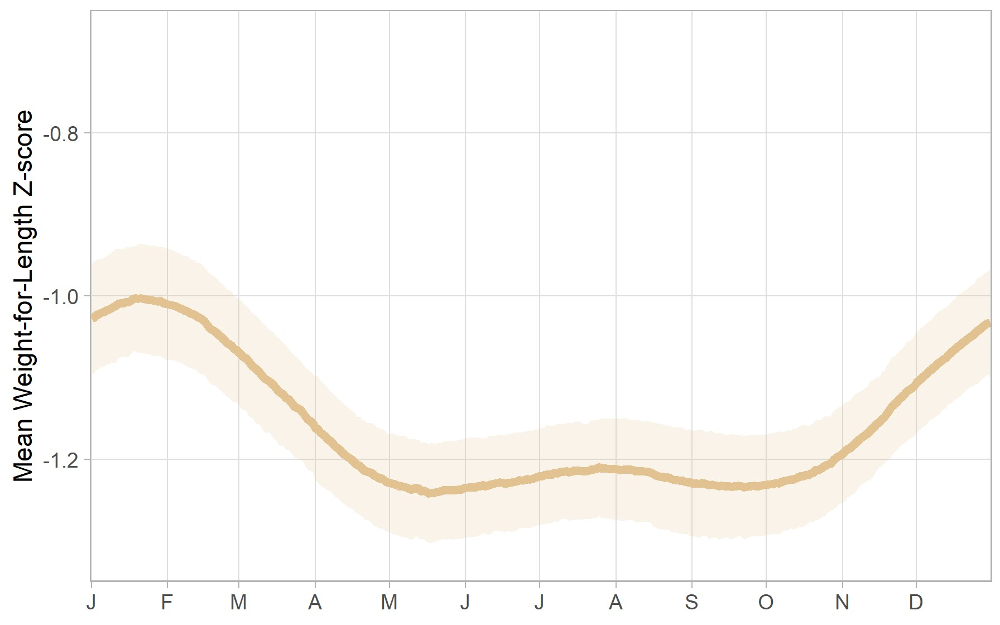
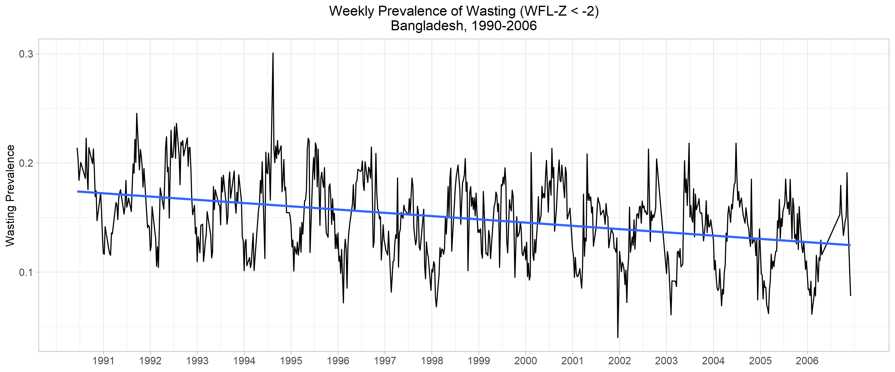

```{r setup, include = FALSE, warning = FALSE}
## libraries
library(tidyverse)
library(readxl)

## trying to improve quality of output images
if (!knitr::is_latex_output()) {
  knitr::opts_chunk$set(dpi = 300, dev.args = list(png = list(type = "cairo")))
}

## time convert function
#Convert a numeric  MATLAB datenum (days since 0000-1-1 00:00) to seconds in 
#the Unix epoch (seconds since 1970-1-1 00:00). Specify a time zone if the 
#input datenum is anything other than the GMT/UTC time zone. 
matlab2POS_dhaka = function(x, timez = "Asia/Dhaka") {
	days = x - 719529 	# 719529 = days from 1-1-0000 to 1-1-1970
	secs = days * 86400 # 86400 seconds in a day
	# This next string of functions is a complete disaster, but it works.
	# It tries to outsmart R by converting the secs value to a POSIXct value
	# in the UTC time zone, then converts that to a time/date string that 
	# should lose the time zone, and then it performs a second as.POSIXct()
	# conversion on the time/date string to get a POSIXct value in the user's 
	# specified timezone. Time zones are a nightmare.
	return(as.Date(as.POSIXct(strftime(as.POSIXct(secs, origin = '1970-1-1', 
			tz = 'Asia/Dhaka'), format = '%Y-%m-%d %H:%M', 
			tz = 'Asia/Dhaka', usetz = FALSE), tz = timez)))
}

```

```{r nsp_data, echo = FALSE, warning = FALSE, cache = TRUE}
## creating nsp dataset

nsp_read = read_excel('./data/nsp_subset_datechanged.xlsx') 

nsp = 
nsp_read %>% 
  select(-rd, -thana, -union, -vill, -para, -match_quality, -year) %>% 
  mutate(dov = as.Date(dov), ## converting POSIXct to Date
         surv_area = as.ordered(surv_area), 
         area_name = as.factor(area_name),
         area_name = forcats::fct_reorder(area_name, as.numeric(surv_area)), ## area_name is factor ordered by surv_area
         zwfl = as.numeric(zwfl), ## NAs will be introduced by coercion
         zlen = as.numeric(zlen),
         zwei = as.numeric(zwei),
         ageindays = as.numeric(ageindays)
  ) 

## area names vector (useful for both NSP and ENACTS)
area_names =
nsp %>% 
  mutate(surv_area = as.numeric(surv_area),
         area_name = as.character(area_name)) %>% 
  group_by(surv_area, area_name) %>% 
  select(surv_area, area_name) %>% 
  arrange(surv_area) %>% 
  unique()

## function to plot raw NSP timeseries by area
plot_zwfl_timeseries = function(area) {
  
  nsp %>% 
    filter(surv_area == area) %>% 
    ggplot(aes(x = dov, y = zwfl)) +
    geom_point(size = 0.01) +
    xlim(as.Date("1990-01-01"), as.Date("2006-12-31")) +
    labs(y = "Weight-for-length Z-score",
         x = "Day",
         title = area_names[[area,2]]) +
    theme_light() +
    theme(plot.title = element_text(hjust = 0.5))
  
}

## plot one NSP area
#  plot_zwfl_timeseries(1)
         
```

```{r enacts, echo = FALSE, warning = FALSE, cache = TRUE}
## reading and cleaning data

enacts_read = read_excel('./data/ENACTS.xlsx')

enacts =
  enacts_read %>% 
  mutate(date = matlab2POS_dhaka(pull(enacts_read, matlab_daynum)),
         surv_area = as.ordered(surv_area)) %>%  ## using MATLAB date conversion defined in beginning (hidden)
  select(surv_area, date, everything(), -matlab_daynum, -month, -year, -contains('runavg'), -hotday, -starts_with('movsum'), -daynum)

## function to plot monthly mean ENACTS by area
plot_monthly_enacts = function(area) {
  
enacts %>% 
  filter(surv_area == area) %>% 
  mutate(month_timeseries = cut(date, breaks = "month"),
         month_timeseries = as.Date(month_timeseries)) %>% 
  group_by(month_timeseries) %>% 
  summarize(mean_tmax = mean(tmax),
            mean_tmin = mean(tmin), 
            mean_precip = mean(precip)) %>% 
  pivot_longer(mean_tmax:mean_precip,
               names_to = "climate_measure",
               values_to = "climate_value") %>%
  mutate(climate_measure = recode(climate_measure, 
                                  'mean_tmax' = 'Tmax [°C]',
                                  'mean_tmin' = 'Tmin [°C]',
                                  'mean_precip' = 'Precip [mm]'),
         climate_measure = as.factor(climate_measure),
         climate_measure = fct_reorder(climate_measure, climate_value)) %>%
  ggplot(aes(x = month_timeseries, y = climate_value)) +
  geom_line(aes(color = climate_measure)) + 
  scale_color_viridis_d(option = "D") + 
  theme_light() +
  theme(legend.position = "bottom",
        legend.title = element_blank(),
        plot.title = element_text(hjust = 0.5)) +
  labs(x = "Month",
       y = "",
       title = str_c("Mean monthly climate patterns, ", area_names[[area,2]])
  )
  
}

## plot one
# plot_monthly_enacts(10)

```
&nbsp;
&nbsp;
&nbsp;
&nbsp;

***
### Summary
Using Poisson regression models, we hope to estimate effects of various climate exposures on childhood acute nutritional outcomes. We will consider climate exposures at multiple timescales, including long-term trends, seasonal patterns, and interannual variation.

***

&nbsp;
&nbsp;

### Background
Climate variability has been shown to influence nutrition via several pathways, including food and financial insecurity, gender-based disempowerment, health services, and environment (Herforth et al, 2014). However, research seldom differentiates nutritional vulnerabilities resulting from climate variation at multiple timescales, e.g. seasonal patterns versus short-term shocks (Füssel & Klein, 2006). This study considers such climate-nutrition associations among children in Bangladesh, a population and country disproportionately at-risk to climate variability and nutritional shocks (Brouwer et al, 2007; Stanberry et al, 2018).

&nbsp;
&nbsp;

### Hypothesis  
Short-term variation in magnitude and timing of childhood wasting will be explained by variation in magnitude and timing of regular climate events.

&nbsp;
&nbsp;

### Data & Variables
Our climate and nutrition data for these analyses come from two different datasets, with observations matched at the day-level by subdistrict. 

#### *Datasets*

  1. **Nutrition Surveillance Project** (NSP). Bangladesh, 1990-2006. N = 796996 measurements of child anthropometry, health, and household characteristics.
  2. **ENACTS** climate data. Bangladesh, 1990-2006. N = 465000+ daily precipitation and temperature observations across 22 subdistricts.

#### *Exposures of interest*
Our climate-related exposures of interest here come from the ENACTS dataset detailed above. They include:

  1. Daily-level precipitation, in millimeters
  2. Daily-level maximum temperature, in degrees Celsius
  3. Daily-level minimum temperature, in degrees Celsius
  
#### *Outcome of interest*
Our outcome of interest, broadly, is acute nutrition status in children under age 5. This is operationalized using an anthropometric measure known as weight-for-length, the ratio of a child's weight to height (or length). This measure is standardized into a Z-score using the WHO Child Growth Standards (World Health Organization, 2006).

&nbsp;
&nbsp;

### Analyses

#### *Unadjusted Poisson Regression Models*

```{r, echo = FALSE, include = FALSE}

## for these formulas, see latex_formulas.Rmd

```
First, we will model our outcome - daily count of wasting, *Y_i* - in univariate models indcluding our three climate exposures separately. These models will be stratified by subdistrict, across the timespan of our study (1990-2006).

*Note:* Each of these Poisson regression models includes an offset term, *n_i*, which indicates the total sample out of which each daily wasting count is measured (i.e., the denominator of the wasting proportion). 

&nbsp;
&nbsp;
&nbsp;



&nbsp;  
&nbsp;


&nbsp;  
&nbsp;



&nbsp;
&nbsp;
&nbsp;

These models may be combined into multivariable Poisson regression models, which may also include interaction terms between exposures.

##### *Mediational Analyses*

Next, we will test diarrheal disease as a potential mediator of each of these relationships by adding a second term to each model:

&nbsp;
&nbsp;
&nbsp;



&nbsp;
&nbsp;
&nbsp;

We expect the addition of diarrhea to the models to bias each main effect towards the null.

##### *Sample weight adjustments*

Since our outcome of interest, child weight-for-length Z-score, was sampled using a multistage cluster design, we will explore the use of sampling weights to increase the precision of our inference. For now, we will focus on the unadjusted and mediational analyses detailed above.

Use of the unadjusted analyses is justified by our belief that there is likely no differential misclassification of exposure or outcome in our sample. Assuming our sample collection was not biased at baseline and representative at the subdistrict level, non-differential misclassification of exposure and/or disease will only bias measures of association towards the null - which, if anything, makes any observed associations more robust.


##### *Other considerations for unadjusted models*

In these unadjusted models, we may also choose to operationalize climate exposures as categories determined by percentile levels to aid in interpretation. For example, on days when precipitation was in the upper 25th percentile for a given region, prevalence of wasting increased by X compared to other days.

Adjusted models could also be constructed from the above that consider region- and/or household-level socioeconomic status. However, these  may be better suited to analyses that consider seasonal and long-term trends in exposure and outcome (below).

&nbsp;

#### *Short-Term Effects Models* 
##### Filtering out long-term and seasonal patterns

Both seasonal (Fig. 1) and long-term (Fig. 2) trends in child wasting have been seen in previous analyses. 


*Figure 1: Multiyear average seasonal wasting model, Shakhipur/Sreepur subdistricts*

&nbsp;


*Figure 2: Downward trend in overall sample prevalence of wasting, 1990-2006*

&nbsp;

These time-dependent patterns are important to consider, especially if we desire a measure of association that is based on variation beyond what is expected within the year and across time. Here, we would like to observe the isolated effects of interannual variation in climate exposures on our outcome of interest, child wasting.

We can "filter" the effects of seasonal patterns by including a pre-fitted Fourier curve as a fixed effect in a Poisson regression model (with count of child wasting as the outcome, as above). We can also include a linear function of time to capture long-term trends.

From here, we can approach the question of isolated interannual variability in at least two ways:

  1. Compare a crude Poisson regression model (with the only predictors being the Fourier term and the linear function) with a model including data on precipitation, minimum temperature, and/or maximum temperature.
  2. Extract the residuals from the crude Poisson regression model in #1, and model these residuals using data on precipitation, minimum temperature, and/or maximum temperature.
  
Each of these methods would help us to answer the question: Apart from knowing the day of the year (season) and year (long-term trend level), does climate information help us predict childhood wasting?

&nbsp;
&nbsp;

### Conclusion

With the above analyses, we hope to address the effects of climate exposures on childhood acute malnutrition (wasting) in Bangladesh.

&nbsp;
&nbsp;

### References  

1. Herforth A, Frongillo EA, Sassi F, et al. (2014). Toward an integrated approach to nutritional quality, environmental sustainability, and economic viability: research and measurement gaps. Annals of the New York Academy of Sciences, 1332(1):1-21. https://doi.org/10.1111/nyas.12552.

2. Füssel, H.‐M. & R.J. Klein. (2006). Climate change vulnerability assessments: an evolution of conceptual thinking. Clim. Change, 75:301–329. https://doi.org/10.1007/s10584-006-0329-3.

3. Brouwer R., Akter S., Brander L. & Haque, E. (2007). Socioeconomic Vulnerability and Adaptation to Environmental Risk: A Case Study of Climate Change and Flooding in Bangladesh. Risk Analysis, 27:313-326. https://doi.org/10.1111/j.1539-6924.2007.00884.x

4. Stanberry LR, Thomson MC & James W. (2018). Prioritizing the needs of children in a changing climate. PLoS Medicine, 15(8):1-4. https://doi.org/10.1371/journal.pmed.1002627.

5. Word Health Organization (2006). WHO Multicentre Growth Reference Study Group. WHO Child Growth Standards: Length/height-for-age, weight-for-age, weight-for-length, weight-for-height and body mass index-for-age: Methods and development. Geneva: World Health Organization. https://www.who.int/childgrowth/standards/Technical_report.pdf?ua=1.