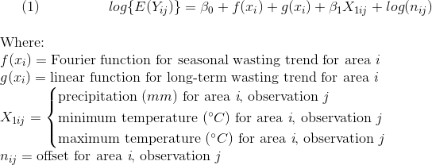

Analytic plan
================
Climatic variation at multiple timescales and under-5 acute
malnutrition: Bangladesh, 1990-2006

  - [**Summary**](#summary)
      - [Hypothesis and research
        questions](#hypothesis-and-research-questions)
      - [Analytic methods](#analytic-methods)
      - [DAG](#dag)
  - [**Details**](#details)
      - [Background](#background)
      - [Hypotheses](#hypotheses)
      - [Data & Variables](#data-variables)
          - [*Datasets*](#datasets)
          - [*Exposures of interest*](#exposures-of-interest)
          - [*Outcome of interest*](#outcome-of-interest)
      - [Analyses](#analyses)
          - [*1. Within-year (Poisson regression)
            models*](#within-year-poisson-regression-models)
          - [*2. Between-year (seasonal)
            models*](#between-year-seasonal-models)
      - [Conclusion](#conclusion)
      - [References](#references)
  - [**To Do**](#to-do)

 

-----

     

# **Summary**

Child acute undernutrition (wasting) exhibits clear seasonal patterns in
Bangladesh, with the highest prevalence occurring from May to October,
approximating the monsoon season. While causes of this phenomenon are
still poorly understood, existing research and recent analyses have
demonstrated both seasonal and shorter-term links between climate and
childhood wasting in Bangladesh.

## Hypothesis and research questions

We hypothesize that weather and climate patterns play key roles in
determining child wasting prevalence in Bangladesh. Specifically, our
research investigates the effects on wasting of **within-year** and
**between-year** (seasonal) variation in weather and climate events.

Broadly, we are interested in answering the following questions:

1.  **Within year.** Controlling for observed seasonal patterns and
    long-term trends in wasting, do weather factors have an effect on
    childhood wasting? (In other words: can weekly weather factors
    explain departures in wasting prevalence from the usual seasonal
    pattern?)
2.  **Between/across years.** Do anomalies predict the timing and
    magnitude of specific seasonal wasting patterns seen across years
    (i.e. the observed ‘wasting season’ from May to October)?

For both questions, our exposure variables of focus will comprise day-
or week-level weather factors: precipitation, maximum temperature, and
minimum temperature. Appropriate lag structures will also be explored.

## Analytic methods

For Question 1, we will model time-series patterns in weekly prevalence
of childhood wasting by weekly weather patterns, disaggregated across
our 25 survey areas. We will use Poisson regression models and include
as covariates seasonal and long-term trends in wasting.

Question 2 is a bit more challenging, but we are considering several
options:

1.  Use methods similar to Hashizume et al (2010), in which the authors
    compare the average annual incidence pattern of cholera predicted by
    each weather factor with an observed average seasonal pattern in
    cholera.
      - Using this method, we would receive an estimate of how well
        weather factors predict seasonal cycles in wasting.
2.  If seasonal analyses aggregated across geographic areas appropriate,
    another option is to build models to predict the timing and
    magnitude of the seasonal wasting cycle using yearly anomalies in
    weather factors as predictors.
      - First, we could judge the appropriateness of geographic
        aggregation by comparing shorter-term effects across areas
        during our Question 1 analyses.

   

## DAG

-----

# **Details**

## Background

Climate variability has been shown to influence nutrition via several
pathways, including food and financial insecurity, gender-based
disempowerment, health services, and environment (Herforth et al, 2014).
However, research seldom differentiates nutritional vulnerabilities
resulting from climate variation at multiple timescales, e.g. seasonal
patterns versus short-term shocks (Füssel & Klein, 2006). This study
considers such climate-nutrition associations among children in
Bangladesh, a population and country disproportionately at-risk to
climate variability and nutritional shocks (Brouwer et al, 2007;
Stanberry et al, 2018).

   

## Hypotheses

We hypothesize that abnormal weather and climate will predict changes in
observed childhood wasting. Specifically:

(Primary Hypothesis) We hypothesize that abnormal (\< 5th percentile or
\> 95th percentile for area-specific data) maximum temperature, minimum
temperature, and precipitation will be positively associated with
prevalence of childhood wasting (acute undernutrition).

(Secondary Hypothesis) We hypothesize that anomalies in timing and
magnitude of regularly-occurring climatic events (e.g. the monsoon
season) will be positively associated with shifts in timing and
magnitude of childhood wasting (acute undernutrition).

   

## Data & Variables

Our climate and nutrition data for these analyses come from two
different datasets, with observations matched on date and subdistrict.

### *Datasets*

1.  **Nutrition Surveillance Project** (NSP). Bangladesh, 1990-2006. N =
    796996 measurements of child anthropometry, health, and household
    characteristics.
2.  **ENACTS** climate data. Bangladesh, 1990-2006. N = 465000+ daily
    precipitation and temperature observations across 22 subdistricts.

### *Exposures of interest*

Our climate-related exposures of interest here come from the ENACTS
dataset detailed above. They include:

1.  Day-level precipitation, in millimeters
2.  Day-level maximum temperature, in degrees Celsius
3.  Day-level minimum temperature, in degrees Celsius

### *Outcome of interest*

Our outcome of interest, broadly, is acute nutritional status in
children under age 5. This is operationalized using an anthropometric
measure known as weight-for-length, the ratio of a child’s weight to
length (or height). This measure is standardized into a Z-score using
the WHO Child Growth Standards (World Health Organization, 2006).

   

## Analyses

### *1. Within-year (Poisson regression) models*

First, we will model our outcome - daily count of wasting, Y*i* - in
univariable time series Poisson regression models, each indcluding our
three climate exposures separately. These models will be stratified by
subdistrict, across the timespan of our study (1990-2006).

The sub-seasonal timescale at which these time series analyses will be
conducted is still to-be-determined, but most likely, the predictors
will assume some sort of a week-based lag structure (e.g. a moving
average over a 0-8 week lag), and our outcome a weekly count
(prevalence) of wasting. This is sensible considering the timescale at
which childhood wasting is likely to be modified as an acute measure;
however, wasting may be less likely to change significantly within a
sub-week time period due to climatic factors. **Further research and
references are needed here.**

*Note:* Each of these Poisson regression models will include an offset
term, N*i*, which indicates the total sample out of which each daily or
weekly wasting count is measured (i.e., the denominator of the wasting
proportion/prevalence). Each model will also control for seasonal and
long-term trends in wasting in order to predict within-year,
sub-seasonal variation. For more information, see section below: [*Note:
Filtering out long-term and seasonal patterns in
wasting.*](https://github.com/simmwill/thesis_timeseries/blob/master/analytic_plan.md#note-filtering-out-long-term-and-seasonal-patterns-in-wasting)

     

     

These models may be combined into a multivariable Poisson regression
model(s), which may also include interaction terms between exposures.

#### Mediational Analyses

As a sub-analysis, we will test diarrheal disease as a potential
mediator of each of these relationships by adding a second term to each
model:

     

     

Since it is a potential mediator, inclusion of diarrheal disease is
expected to push each main effect towards the null.

#### Sample weight adjustments

Since our outcome of interest, child weight-for-length Z-score, was
sampled using a multistage cluster design, we will explore the use of
sampling weights to increase the precision of our inferences. For now,
we will focus on the univariable/multivariable and mediational analyses
detailed above.

Use of unweighted analyses is currently justified by our belief that
there is likely no differential misclassification of exposure or outcome
in our sample. Assuming our sample collection was not biased at baseline
and representative at the subdistrict level, non-differential
misclassification of exposure and/or disease will only bias measures of
association towards the null - which, if anything, makes any observed
associations more robust.

#### Other considerations for univariable and multivariable within-year models

In these models, we may also choose to operationalize climate exposures
as categories determined by percentile levels to aid in interpretation.
For example, on days when precipitation was in the upper 25th percentile
for a given region, prevalence of wasting was X times the prevalence
compared to all other days.

Adjusted models could also be constructed from the above models that
consider region- and/or household-level socioeconomic status.

#### Note: Filtering out long-term and seasonal patterns in wasting

Both seasonal (Fig. 1) and long-term (Fig. 2) trends in child wasting
have been seen in previous analyses.

 *Figure 1: Multiyear
average seasonal wasting model, Shakhipur/Sreepur subdistricts*

 

 *Figure 2: Downward trend in
overall sample prevalence of wasting, 1990-2006*

 

These time-dependent patterns are important to consider, especially if
we desire a measure of association that is based on variation beyond
what is expected within the year and across time. Here, we would like to
observe the isolated effects of within-year variation in climate
exposures on our outcome of interest, child wasting.

As mentioned above, we can “filter” the effects of seasonal patterns in
wasting by including a pre-fitted Fourier curve as a fixed effect in our
Poisson regression models. We can also include a linear function of time
to capture long-term trends in wasting.

Using our models above, we can undergo a sort of predictive analysis by
either:

1.  Comparing a crude Poisson regression model (with the only predictors
    being the seasonal Fourier term and the linear time function) with
    our final model including data on precipitation, minimum
    temperature, and/or maximum temperature;
2.  Extract the residuals from a crude Poisson regression model detailed
    in \#1, and model these residuals using our final model
    specifications on precipitation, minimum temperature, and/or maximum
    temperature.

Each of these methods would help us to answer the question: Apart from
knowing the day of the year (season) and year (long-term trend level),
does climate information help us predict childhood wasting? How good is
our model above a baseline model including only modelled seasonal and
long-term trends?

   

### *2. Between-year (seasonal) models*

Our second set of models - those predicting shifts in timing and
magnitude of regularly-occurring wasting patterns - are more preliminary
at this point.

As noted above, we are considering two options currently, but are
actively researching this topic: 1. Use methods similar to Hashizume et
al (2010), in which the authors compare the average annual incidence
pattern of cholera predicted by each weather factor with an observed
average seasonal pattern in cholera. \* Using this method, we would
receive an estimate of how well weather factors predict seasonal cycles
in wasting. 2. If seasonal analyses aggregated across geographic areas
appropriate, another option is to build models to predict the timing and
magnitude of the seasonal wasting cycle using yearly variation in
weather factors as predictors. \* First, we could judge the
appropriateness of geographic aggregation by comparing shorter-term
effects across areas during our Question 1 analyses.

Regardless, we would like as an outcome some indicator of how well
fluctuations in timing and magnitude of climate events alters the
magnitude and timing of the observed ‘wasting season’ in Bangladesh.

Ideally, this would include predictive effect measures useful from a
policy perspective. Examples:  
\* For every 1mm increase in peak monsoon rainfall, we expect to see a
X% increase in childhood wasting peak during the wasting season. \*
Within two weeks following a heatwave, we expect to see an increase of
X% in childhood wasting for every degree of maximum temperature
exceeding X degrees.

## Conclusion

With the above analyses, we hope to address the effects of climate
exposures on childhood acute malnutrition (wasting) in Bangladesh. Our
ultimate goal is to build upon existing relationships with the
Government of Bangladesh and local NGOs, continuing to inform
nutrition-sensitive climate adaptations and interventions in Bangladesh.

   

## References

1.  Herforth A, Frongillo EA, Sassi F, et al. (2014). Toward an
    integrated approach to nutritional quality, environmental
    sustainability, and economic viability: research and measurement
    gaps. Annals of the New York Academy of Sciences, 1332(1):1-21.
    <https://doi.org/10.1111/nyas.12552>.

2.  Füssel, H.‐M. & R.J. Klein. (2006). Climate change vulnerability
    assessments: an evolution of conceptual thinking. Clim. Change,
    75:301–329. <https://doi.org/10.1007/s10584-006-0329-3>.

3.  Brouwer R., Akter S., Brander L. & Haque, E. (2007). Socioeconomic
    Vulnerability and Adaptation to Environmental Risk: A Case Study of
    Climate Change and Flooding in Bangladesh. Risk Analysis,
    27:313-326. <https://doi.org/10.1111/j.1539-6924.2007.00884.x>

4.  Stanberry LR, Thomson MC & James W. (2018). Prioritizing the needs
    of children in a changing climate. PLoS Medicine, 15(8):1-4.
    <https://doi.org/10.1371/journal.pmed.1002627>.

5.  Word Health Organization (2006). WHO Multicentre Growth Reference
    Study Group. WHO Child Growth Standards: Length/height-for-age,
    weight-for-age, weight-for-length, weight-for-height and body mass
    index-for-age: Methods and development. Geneva: World Health
    Organization.
    <https://www.who.int/childgrowth/standards/Technical_report.pdf?ua=1>.

6.  Hashizume M, Faruque AS, Wagatsuma Y, Hayashi T, Armstrong B (2010).
    Cholera in Bangladesh: climatic components of seasonal variation.
    Epidemiology. 2010 Sep;21(5):706-10.
    <https://doi.org/10.1097/EDE.0b013e3181e5b053>.

# **To Do**

0.  Resources
    
      - People
          - Andrew Rundle
          - Pam Factor-Litvak
      - Research
      - *Sick individuals and sick populations* (Rose, 1985) - shifts in
        seasonal curves from year to year \~= shifting population curve
        over time

1.  What are the problems that we want to address?
    
      - What are the associated causal questions, considering a
        counterfactual framework?
      - What are the relationship(s) that comprise these questions
        \[exposure(s) and outcome(s)\]?
      - What are the alternative explanations for the relationship(s)
        \[confounders in our DAGs\]?

2.
