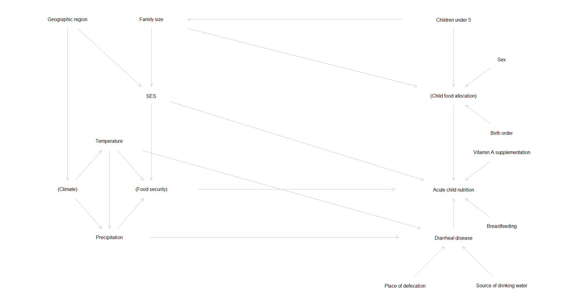

#### *Summary*

This is a short overview of the planned ACToday research project investigating the association between extreme climate events and acute nutritional outcomes (weight-for-height, or wasting) in children under 5.

What follows is an analytic plan containing research questions, hypotheses, and statistical modelling considerations. See Appendix for a preliminary outline of the Introduction section, including current state of the literature, gaps in knowledge, and biologically plausible pathways for relationships explored.

&nbsp;

#### *Analysis Plan*

##### *Research Questions*

  1. Do extreme climate events increase prevalence of wasting among children in Bangladesh? 
      a. Extreme heat
      b. Extreme precipitation
  2. If so, are there lags that are important to these relationships?
  3. Are there differential effects by region and/or season that should be accounted for?
  
&nbsp;  
  
##### *Hypotheses*

  1. Extreme heat and extreme (high) precipitation will be positively associated with prevalence of under-5 wasting in Bangladesh.
  2. Lag periods will differ for extreme heat and extreme precipitation, but will be important for each exposure-outcome association.
  3. There will be differential associations between climate and acute malnutrition by (a) region and (b) season.

&nbsp;

##### *Methods*

Variables and measurements of interest:

  * Exposures
    + **Extreme Heat Exposure**
      + Maximum and minimum daily temperatures above 95th percentile for 3+ consecutive days
        + Each is a "heat wave", separated from other waves by at least one day
      + Cumulative days with maximum and minimum temperature above 95th percentile
        + Each is a "heat wave day" without respect to continuity of days
      + Percentile definition: Xth percentile of daily values defined over all days between 1990 and 2006 for each subdistrict
      + Nissan et al 2017
    + **Extreme (High) Precipitation**
      + At least preliminarily, use definition based on above: daily precipitation above 95th percentile 
      + Cumulative days with precipitation over 95th percentile, without respect to continuity of days
        + "Extreme precipitation days"
      + Other considerations:
        + Explore relationship between precipitation and outcome using nonlinear methods
        + Approach similar to Hashizume et al (2007/8) threshold at which risk increases both above/below
          + e.g. for a 10mm decrease in precipitation (weekly, or another aggregate measure) below the X mm treshold, risk of wasting increased by X.XX
        
  * Outcome
    + **Wasting**, defined as an individual's weight-for-height Z-score (WHZ) < -2 (more than 2 standard deviations below the reference mean)
      + In a Poisson model using repeated cross-sectional survey data, outcome (an exponentiated beta estimate) can be interpreted as the multiplicative increase in wasting prevalence given a 1-unit increase in the predictor, holding all other covariates constant (**prevalence ratio**)
        + This is similar in a log-binomial model
      + Can also back-calculate to observe the **prevalence difference** - absolute difference (additive) in prevalence given a 1-unit increase in the predictor, holding all other variables constant
        + Cross-sectional data allows calculation of conditional probability of disease given exposure status
    
  * Covariates
    + **Geographic area** (subdistrict or larger)
    + Month of year or **season** term (e.g. spline)
    + Year or **long-term-trend** (e.g. spline)

Statistical Methods:

  * Fit **adjusted weekly time series model** to estimate association (prevalence ratio) between weekly measures of extreme climate and weekly wasting prevalence
  * Considerations:
    + **Nonlinear** associations between exposures/covariates and outcome (use of piecewise functions, splines, etc.)
    + **Lags** of exposure-outcome associations (use of Distributed Lag Nonlinear Models, see works by Gasparrini)
    + Need for adjustment of **overdispersion**, if present in Poisson model (use of quasi-Poisson or negative binomial)
    + **Zero inflation** in count data (use of zero-inflated Poisson or zero-inflated negative binomial models)
  
  
<!--
# Old Statistical Methods

  # * Fit adjusted relative risk regression model (Zou 2004) to estimate association (prevalence ratio) between extreme climate events and wasting prevalence
  #   + Considerations:
  #     + Nonlinear relationships between exposures/covariates and outcome (use of piecewise functions, splines, etc.)
  #     + Log-binomial vs. robust error variance via Poisson model with sandwich estimator (Chen et al 2018)
  # * Other options
  #   + Poisson timeseries for count of wasting
  #     + Scale: daily, weekly
  #     + Zero-inflated? 
  #     + Would need to be quasi-poisson or negative binomial given likely overdispersion (after comparing marginal mean and var)
  #   + Case-crossover
  #     + Similar in implementation and results as poisson timeseries if covariates are the same
  #     + Advantages: confounding control built into model if correctly specified; able to test for effects of and effect modification by individual-level factors
-->

&nbsp;

##### *Figures*

```{r, echo = FALSE, message = FALSE, warning = FALSE}
library(tidyverse)
library(knitr)
library(kableExtra)
library(patchwork)
library(gt)
library(viridis)

knitr::opts_knit$set(dev.args = list(type = "cairo"))
options(scipen = 999)

data = readRDS('./data/nsp_enacts_extreme')

```

<!--
Figure 1: Analysis Directed Acyclic Graph (DAG)
<br><center>  </center><br>

```{r, fig.width = 12, fig.height = 6, echo = FALSE, message = FALSE, warning = FALSE}
## density ridges

# a = # for first 11
# data %>% 
#   group_by(area_name) %>% 
#   mutate(area_zwfl = mean(zwfl)) %>% 
#   ungroup() %>% 
#   mutate(area_name = fct_reorder(area_name, desc(area_zwfl))) %>% 
#   ggplot(aes(x = zwfl, y = area_name, fill = area_name)) +
#   ggridges::geom_density_ridges(alpha = .4, scale = .7) +
#   scale_fill_viridis(discrete = TRUE) +
#   theme_bw() +
#   theme(legend.position = "none")
# 
# b = # for second 11, then do a + b

## boxplots
data %>%
  group_by(area_name) %>%
  mutate(area_zwfl = median(zwfl)) %>%
  ungroup() %>%
  mutate(area_name = fct_reorder(area_name, area_zwfl)) %>%
  ggplot(aes(x = area_name, y = zwfl, fill = area_name)) +
  geom_boxplot(alpha = .4) +
  scale_fill_viridis(discrete = TRUE) +
  theme_bw() +
  theme(legend.position = "none",
        axis.text.x = element_text(size = 8, angle = 45, hjust = 1)) +
  labs(x = "Area",
       y = "WHZ",
       title = "Figure 2: Weight-for-Height Z-score Distribution by Area")

```

```{r, fig.width = 12, fig.height = 6, echo = FALSE, message = FALSE, warning = FALSE}
data %>% 
  mutate(wasting = case_when(wasting == TRUE ~ "Wasting",
                             wasting == FALSE ~ "No Wasting"),
         wasting = as.factor(wasting)) %>% 
  ggplot(aes(x = wasting, y = tmax, fill = wasting)) +
  geom_violin() +
  geom_boxplot(width = 0.1, color = "darkgrey", alpha = 0.2) +
  labs(x = "Wasting Status",
       y = "Maximum Temperature (C)",
       title = "Figure 3: Daily Maximum Temperature Distribution by Wasting Status") +
  stat_summary(fun.y = median, geom = "point", color = "darkred", size = 2) +
  scale_fill_brewer(palette = 2) +
  theme_bw() +
  theme(legend.position = "none")

data %>% 
  mutate(wasting = case_when(wasting == TRUE ~ "Wasting",
                             wasting == FALSE ~ "No Wasting"),
         wasting = as.factor(wasting)) %>% 
  ggplot(aes(x = wasting, y = tmin, fill = wasting)) +
  geom_violin() +
  geom_boxplot(width = 0.1, color = "darkgrey", alpha = 0.2) +
  labs(x = "Wasting Status",
       y = "Minimum Temperature (C)",
       title = "Figure 4: Daily Minimum Temperature Distribution by Wasting Status") +
  stat_summary(fun.y = median, geom = "point", color = "darkred", size = 2) +
  scale_fill_brewer(palette = 1) +
  theme_bw() +
  theme(legend.position = "none")

```


```{r, fig.width = 12, fig.height = 6, echo = FALSE, message = FALSE, warning = FALSE}

data %>% 
  # filter(!(month %in% c(11, 12, 1, 2))) %>% 
  group_by(surv_area, month, year) %>% 
  mutate(precip_mo = mean(precip)) %>% 
  ungroup() %>% 
  mutate(wasting = case_when(wasting == TRUE ~ "Wasting",
                             wasting == FALSE ~ "No Wasting"),
         wasting = as.factor(wasting)) %>% 
  ggplot(aes(x = wasting, y = precip_mo, fill = wasting)) +
  geom_violin() +
  geom_boxplot(width = 0.1, color = "darkgrey", alpha = 0.2) +
  labs(x = "Wasting Status",
       y = "Monthly Mean Precipitation (mm)",
       title = "Figure 5: Monthly Mean Precipitation Distribution by Wasting Status",
       caption = "Monthly mean precipitation used due to excess daily 0 values.") +
  stat_summary(fun.y = median, geom = "point", color = "darkred", size = 2) +
  scale_fill_brewer(palette = 4) +
  theme_bw() +
  theme(legend.position = "none")

```
-->

```{r, fig.width = 12, fig.height = 6, echo = FALSE, message = FALSE, warning = FALSE}
library(lubridate)
library(mgcv)

## time trend spaghetti plot
data %>% 
  mutate(month_year = lubridate::floor_date(dov, "month")) %>% 
  group_by(area_name, surv_area, month_year) %>% 
  summarize(wasting_month = mean(wasting)) %>% 
  ungroup() %>% 
 # mutate(surv_area = as.numeric(surv_area)) %>% 
  ggplot(aes(x = month_year, y = wasting_month)) +
  geom_point(size = .5, alpha = .5) +
  ylim(0, 0.4) +
  theme_bw() +
  labs(x = "Month/Year",
       y = "Monthly Wasting Prevalence",
       title = "Figure 1: Monthly Wasting Prevalence, by Survey Area") +
  
  geom_smooth(method = gam, formula = y ~ s(x, k = 4), size = .1, alpha = .1) + ## penalized spline with 4 knots
  
  
  facet_wrap(~area_name) 

```

&nbsp;

##### *Remaining questions*

  * Do we want to look at low-rainfall events too? Seems for shocks that high rainfall may be most important, but not sure
  * What is the expected onset period for wasting following a causal event?
    * Rapid onset of wasting - no specific timeframe given (WFP 2005)
    * Rapid recovery - within 3 months (Rivera and Habicht 1996)
  * Other pathways that are biologically plausible besides cholera/non-cholera diarrhea?
  * Include holiday indicator as covariate (potential confounder)?
  * Consider autocorrelations of time-series data?
  
<!--
```{r, eval = FALSE, echo = FALSE}
library(tidyverse)
library(knitr)
library(kableExtra)
library(patchwork)
library(gt)
library(logbin)
library(geepack)

data = readRDS('./data/nsp_enacts_extreme')
```

```{r, eval = FALSE, echo = FALSE}
##### LOG-BINOMIAL #####
set.seed(1)

## crude temp model from summer work
logbin_results_temp =
  data %>% 
  sample_frac(.5) %>% 
  logbin(
    data = .,
    formula = wasting ~ temp_indicator,
    method = 'em',
    accelerate = 'squarem' # these two options speed the convergence
  )

## crude precip model from summer work
logbin_results_precip =
  data %>% 
  sample_frac(.5) %>% 
  logbin(
    data = .,
    formula = wasting ~ precip_indicator,
    method = 'em',
    accelerate = 'squarem' # these two options speed the convergence
  )

## adjusted temp model
adj_logbin_results = 
  data %>% 
  sample_frac(.5) %>%  ## to speed convergence for now
  logbin(
    data = .,
    formula = wasting ~ precip_indicator + temp_indicator
      + surv_area + month + year,
    method = 'em',
    accelerate = 'squarem'
  )

  ## beta estimates: precip1 NS, temp1 0.0393 (p<0.0005), temp2 NS
    ### beta est for temp1 smaller than robust poisson

```

```{r, eval = FALSE, echo = FALSE}
##### ROBUST POISSON #####
set.seed(1)

## Common outcome: log link, poisson family, robust estimator (modified Poisson with robust estimator by Zou)
sandwich_results_temp =
  data %>% 
  mutate(surv_area = as.numeric(surv_area),
         id = 1:nrow(data)) %>% 
  # arrange(surv_area, dov) %>% 
  select(id, everything()) %>% 
  sample_frac(0.5) %>% 
  arrange(id) %>% 
  geeglm(formula = wasting ~ temp_indicator,
         data = .,
         family = poisson(link = "log"),
         id = id,
         corstr = "exchangeable")

  ## beta estimate for temp2 is quite a bit higher - logbin 0.294 vs. poisson 0.426
  ## not using these indicators for publication, but need to look more into this

sandwich_results_precip =
  data %>% 
  mutate(surv_area = as.numeric(surv_area),
         id = 1:nrow(data)) %>% 
  # arrange(surv_area, dov) %>% 
  select(id, everything()) %>% 
  sample_frac(0.5) %>% 
  arrange(id) %>% 
  geeglm(formula = wasting ~ precip_indicator,
         data = .,
         family = poisson(link = "log"),
         id = id,
         corstr = "exchangeable")

  ## very similar to log-bin, but with larger SEs

adj_sandwich_results =
  data %>% 
  mutate(surv_area = as.numeric(surv_area),
         id = 1:nrow(data)) %>% 
  # arrange(surv_area, dov) %>% 
  select(id, everything()) %>% 
  sample_frac(0.5) %>% 
  arrange(id) %>% 
  geeglm(formula = wasting ~ precip_indicator + temp_indicator
                  + surv_area + month + year,
         data = .,
         family = poisson(link = "log"),
         id = id,
         corstr = "exchangeable")

  ## beta estimates: precip1 NS, temp1 0.0634 (p<0.0001), temp2 NS
    ### temp2 coefficient larger than in log-bin model

```

```{r, eval = FALSE, echo = FALSE}
##### POISSON #####
## if using count data
## assessing overdisperson in data - daily counts divided by daily surveyed, by area

data %>% 
  group_by(dov, surv_area) %>% 
  summarize(cases = sum(wasting),
            offset = n(),
            rate = cases/offset) %>% 
  filter(offset > 9) %>% 
  mutate(surv_area = as.numeric(surv_area)) %>% 
  arrange(surv_area, dov) %>% 
  ggplot(aes(x = dov, y = rate)) +
  geom_point(size = .1, alpha = .1) +
  facet_wrap(~surv_area)

  ## 44,907 area-days for all offsets
  ## 32,223 area-days for offset >= 10

  ## assessing overdispersion (roughly) by comparing marginal mean to marginal variance of outcome rate, by area (for this to be accurate, would need to compare conditional outcomes, but not possible - this is decent proxy)
  ungroup() %>% 
  group_by(surv_area) %>% 
  summarize(mean = mean(rate),
            var = var(rate)
  ) %>% view

  ## quite overdispersed in all areas, with means around ~0.14 and variances around ~0.014

## if we're doing timeseries, would need to use quasi-likelihood
```
-->

&nbsp;

##### *Appendix:* Introduction outline

  * Climate increasingly variable, with higher average temperatures and increased frequency of extreme events already observed and anticipated to worsen
    + IPCC, 2018
  * Bangladesh consistently indicated as one of the most vulnerable countries to the effects of climate change
    + Ali, 1999
    + Huq, 2001
    + Minar et al, 2013
    + Eckstein et al, 2018
  * Climate is inextricably linked to health, with some of the most direct effects seen in agriculture and nutrition 
    + Fanzo et al, 2017
    + IPCC, 2018
    + United Nations General Assembly, 2019
  * Research has identified several pathways by which climate can influence nutrition
    + Food and financial insecurity, primarily via agricultural pathways
    + Gender-based disempowerment
    + Health services
    + Environmental factors that cause disease spread
    + Herforth et al, 2014
  * Malnutrition is an important health outcome, especially among children
    + UNICEF, 2019
    + World Health Organization, 2019
  * Wasting (weight-for-height) is an important measure of malnutrition
    + Valid measure of acute malnutrition in children (WHO, 2010)
    + Valid proxy measure for a population’s overall acute nutritional status, as children respond more rapidly to nutrition-related shocks (World Food Programme, 2005)
    + Linked with other health outcomes, such as infectious disease vulnerability, impaired mental development, and mortality (Fauveau et al, 1990; Pelletier, 1994; Caulfield et al, 2006; Faruque et al, 2008; Dicker et al, 2018)
  * Existing literature has looked at components of the climate-nutrition pathways in Bangladesh, including:
    + Infectious disease (e.g. cholera articles by Hashizume et al: 2007/8/9/10)
    + Health systems (Toufique et al, 2014)
    + Food price and income shocks (Akter and Basher, 2014)
    + Systematic review of climate-undernutrition literature- Phalkey et al, 2015
  * Existing literature is fairly consistent on effects of climatologic factors on undernutrition
    + See Phalkey et al, 2015 for systematic review of literature linking climate and undernutrition up to 2012
      + Among studies, generally agreed that variations in the rainfall explain crop
      + Extreme climate (droughts and floods) investigated in 4 studies each, with significant effect estimates 
failures, which in turn affect nutrition
    + _**[several others]**_
  * However, few studies in Bangladesh have explicitly linked direct measures of climate with a standard identifier of growth faltering such as weight-for-height (WHO and UNICEF, 2009)
    + Stewart et al, 1990 - floods may have delayed normal recovery period from seasonal malnutrition in Matlab (normally Oct-Dec)
      + WAZ, WHZ, HAZ
    + Tetens et al, 2002 - seasonality not observed in measure of underweight among children (lean vs. peak season)
      + WAZ, also BMI investigated in adults
    + Buttenheim et al, 2006 - counterintuitive results looking at difference-in-difference among post-flood vulnerable/non-vulnerable households (preliminary results - not citeable)
      + HAZ
    + Beier et al, 2015 - use BMI as covariate in estimating self-reported disease in coastal Bangladesh
      + BMI
      + We are looking at disease as a pathway to malnutrition, which may be equally justified given the known malnutrition-infection cycle (Katona and Katona-Apte, 2008; and other research)
    + Cooper et al, 2019 - used standardized precipitation index (SPI), measure of wetness relative to long-term norm
      + Negatively associated with WHZ in Ghana but not Bangladesh
  * Thus, goal of this study is to link extreme climate events with a measure of acute malnutrition, weight-for-height
  * Biologically-plausible pathways from extreme rainfall, temperature to wasting
    + Heat
      + Plausible pathways between extreme heat and acute malnutrition are not as readily understandable as those with extreme precipitation, but the link from heat to cholera, diarrhea, and other nutrition-adjacent outcomes is robust in the literature
      + Proposed explanations:
        + heat --> non-cholera diarrhea --> wasting (Singh et al 2001, Hashizume et al 2007, Mertens et al 2019)
        + heat --> ? --> seasonal cholera --> diarrhea/immunocompromised --> wasting (Checkley et al 2000, Lama et al 2004)
        + heat --> dehydration --> **misclassification** due to water loss --> "wasting" (Mwangome et al 2011)
    + Precipitation
      + The link between heavy precipitation and acute malnutrition is a bit easier to conceptualize, and related links are found throughout the literature
      + Proposed explanations:
        + precipitation --> contaminated runoff, water quality, environmental contact with pathogens --> non-cholera diarrhea --> wasting (Singh et al 2001, Hashizume et al 2007, Mertens et al 2019)
        + precipitation --> river level? --> seasonal cholera --> diarrhea/immunocompromised --> wasting (Hashizume et al 2008/2010)
