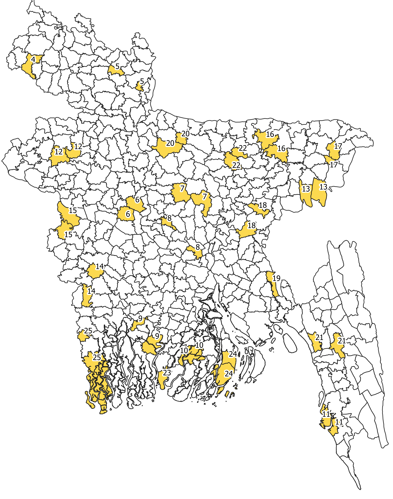

```{r setup, echo = FALSE, message = FALSE}

library(tidyverse)
library(readxl)
library(knitr)
library(kableExtra)

# Creating function to convert MATLAB date to R date

#Convert a numeric  MATLAB datenum (days since 0000-1-1 00:00) to seconds in 
#the Unix epoch (seconds since 1970-1-1 00:00). Specify a time zone if the 
#input datenum is anything other than the GMT/UTC time zone. 
matlab2POS_dhaka = function(x, timez = "Asia/Dhaka") {
	days = x - 719529 	# 719529 = days from 1-1-0000 to 1-1-1970
	secs = days * 86400 # 86400 seconds in a day
	# This next string of functions is a complete disaster, but it works.
	# It tries to outsmart R by converting the secs value to a POSIXct value
	# in the UTC time zone, then converts that to a time/date string that 
	# should lose the time zone, and then it performs a second as.POSIXct()
	# conversion on the time/date string to get a POSIXct value in the user's 
	# specified timezone. Time zones are a nightmare.
	return(as.Date(as.POSIXct(strftime(as.POSIXct(secs, origin = '1970-1-1', 
			tz = 'Asia/Dhaka'), format = '%Y-%m-%d %H:%M', 
			tz = 'Asia/Dhaka', usetz = FALSE), tz = timez)))
}

```

This document details data cleaning for NSP/ENACTS data analysis. The resulting datafile includes:

  * Cleaned NSP (nutrition) datafile
  * Cleaned ENACTS (climate) datafile
  * Joined ENACTS/NSP datafile


# Importing and cleaning NSP data

```{r, warning = FALSE}
nsp = read_excel('./data/nsp_subset_datechanged.xlsx') %>% 
  select(-rd, -thana, -union, -vill, -para, -match_quality, -year) %>% 
  mutate(dov = as.Date(dov), ## converting POSIXct to Date
         surv_area = as.ordered(surv_area), 
         area_name = as.factor(area_name),
         area_name = forcats::fct_reorder(area_name, as.numeric(surv_area)), ## area_name is factor ordered by surv_area
         zwfl = as.numeric(zwfl), ## NAs will be introduced by coercion
         zlen = as.numeric(zlen),
         zwei = as.numeric(zwei),
         ageindays = as.numeric(ageindays)
  ) %>% 
  arrange(surv_area, dov)
```

## Survey Areas contained in NSP dataset

```{r, echo = FALSE, fig.width = 4}
area_names =
nsp %>% 
  mutate(surv_area = as.numeric(surv_area),
         area_name = as.character(area_name)) %>% 
  group_by(surv_area, area_name) %>% 
  select(surv_area, area_name) %>% 
  arrange(surv_area) %>% 
  unique()

kable(area_names,
      col.names = c("Area #",
                    "Survey Area")) %>% 
  kable_styling(bootstrap_options = "striped", full_width = F, position = "left")
```

<center>

</center>

Above are the 25 survey areas included in the NSP dataset. These areas are distributed throughout Bangladesh and were surveyed from 1990-2006 (N = 796996).

## Visualizing timeseries nutrition data

```{r, fig.width = 12, warning = FALSE}
## plotting function
plot_zwfl_timeseries = function(area) {
  
  nsp %>% 
    filter(surv_area == area) %>% 
    ggplot(aes(x = dov, y = zwfl)) +
    geom_point(size = 0.01) +
    xlim(as.Date("1990-01-01"), as.Date("2006-12-31")) +
    labs(y = "Weight-for-length Z-score",
         x = "Day",
         title = area_names[[area,2]]) +
    theme_light() +
    theme(plot.title = element_text(hjust = 0.5))
  
}


## plot one area
plot_zwfl_timeseries("1")


# plot the rest
# for (i in 1:25) {
#   
#   f = plot_zwfl_timeseries(i)
#   print(f)
#   
# }

### Create a Shiny app to embed here - dropdown menu of Survey Areas, with plot of timeseries data for each

```

# Cleaning ENACTS data

```{r}
enacts_read = read_excel('./data/ENACTS.xlsx') 

enacts =
  enacts_read %>% 
  mutate(date = matlab2POS_dhaka(pull(enacts_read, matlab_daynum)),
         surv_area = as.ordered(surv_area)) %>%  ## using MATLAB date conversion defined in beginning (hidden)
  select(surv_area, date, everything(), -matlab_daynum, -month, -year, -contains('runavg'), -hotday, -starts_with('movsum'), -daynum)

saveRDS(enacts, file = './data/enacts')
```

## Visualizing timeseries climate data

```{r, fig.width = 12}
plot_monthly_enacts = function(area) {
  
enacts %>% 
  filter(surv_area == area) %>% 
  mutate(month_timeseries = cut(date, breaks = "month"),
         month_timeseries = as.Date(month_timeseries)) %>% 
  group_by(month_timeseries) %>% 
  summarize(mean_tmax = mean(tmax),
            mean_tmin = mean(tmin), 
            mean_precip = mean(precip)) %>% 
  pivot_longer(mean_tmax:mean_precip,
               names_to = "climate_measure",
               values_to = "climate_value") %>%
  mutate(climate_measure = recode(climate_measure, 
                                  'mean_tmax' = 'Tmax [°C]',
                                  'mean_tmin' = 'Tmin [°C]',
                                  'mean_precip' = 'Precip [mm]'),
         climate_measure = as.factor(climate_measure),
         climate_measure = fct_reorder(climate_measure, climate_value)) %>%
  ggplot(aes(x = month_timeseries, y = climate_value)) +
  geom_line(aes(color = climate_measure)) + 
  scale_color_viridis_d(option = "D") + 
  theme_light() +
  theme(legend.position = "bottom",
        legend.title = element_blank(),
        plot.title = element_text(hjust = 0.5)) +
  labs(x = "Month",
       y = "",
       title = str_c("Mean monthly climate patterns, ", area_names[[area,2]])
  )
  
}

# # plot one
plot_monthly_enacts(10)

## plot the rest
# plot the rest
# for (i in 4:25) {
#   
#   f = plot_monthly_enacts(i)
#   print(f)
#   
# }
#        

### Create a Shiny App similar to above and embed - dropdown menu of survey areas, plot of ENACTS data for each
```

# Joining datasets

```{r joining}
nsp_zwfl =
  nsp %>% 
  select(-zwei, -zlen) 

NSP_enacts_nomissing = 
  inner_join(nsp_zwfl, enacts, by = c("dov" = "date", "surv_area")) %>% 
  drop_na()

saveRDS(NSP_enacts_nomissing, file = './data/nsp_enacts')
```

