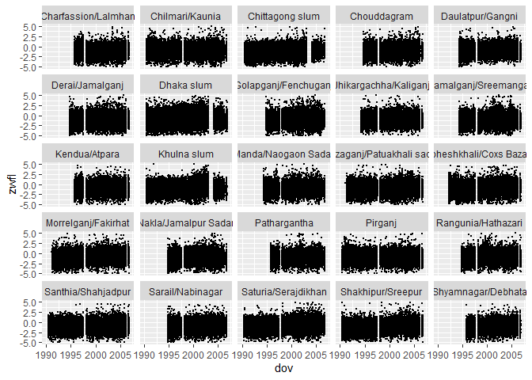

Exploratory Data Analysis
================
Will Simmons
11/4/2019

``` r
library(tidyverse)
```

    ## -- Attaching packages ---------------------------------------------------------------------------------------------- tidyverse 1.2.1 --

    ## v ggplot2 3.2.1     v purrr   0.3.3
    ## v tibble  2.1.3     v dplyr   0.8.3
    ## v tidyr   1.0.0     v stringr 1.4.0
    ## v readr   1.3.1     v forcats 0.4.0

    ## -- Conflicts ------------------------------------------------------------------------------------------------- tidyverse_conflicts() --
    ## x dplyr::filter() masks stats::filter()
    ## x dplyr::lag()    masks stats::lag()

``` r
library(readxl)
```

#### Importing and cleaning data

``` r
nsp = read_excel('./data/nsp_subset_datechanged.xlsx') %>% 
  select(-rd, -thana, -union, -vill, -para, -match_quality, -year) %>% 
  mutate(dov = as.Date(dov), tz = 'Asia/Dhaka', ## converting POSIXct to Date
         surv_area = as.ordered(surv_area), 
         ## turn area_name into factor linked with surv_area?
         zwfl = as.numeric(zwfl), ## NAs will be introduced by coercion
         zlen = as.numeric(zlen),
         zwei = as.numeric(zwei),
         ageindays = as.numeric(ageindays)
  )
```

#### Table of survey area number by area name

| surv\_area | area\_name                 |
| :--------- | :------------------------- |
| 1          | Dhaka slum                 |
| 2          | Khulna slum                |
| 3          | Chittagong slum            |
| 4          | Pirganj                    |
| 5          | Chilmari/Kaunia            |
| 6          | Santhia/Shahjadpur         |
| 7          | Shakhipur/Sreepur          |
| 8          | Saturia/Serajdikhan        |
| 9          | Morrelganj/Fakirhat        |
| 10         | Mirzaganj/Patuakhali sadar |
| 11         | Moheshkhali/Coxs Bazaar    |
| 12         | Manda/Naogaon Sadar        |
| 13         | Kamalganj/Sreemangal       |
| 14         | Jhikargachha/Kaliganj      |
| 15         | Daulatpur/Gangni           |
| 16         | Derai/Jamalganj            |
| 17         | Golapganj/Fenchuganj       |
| 18         | Sarail/Nabinagar           |
| 19         | Chouddagram                |
| 20         | Nakla/Jamalpur Sadar       |
| 21         | Rangunia/Hathazari         |
| 22         | Kendua/Atpara              |
| 23         | Pathargantha               |
| 24         | Charfassion/Lalmhan        |
| 25         | Shyamnagar/Debhata         |

#### Survey frequency by time and area

``` r
nsp %>% 
  ggplot(aes(x = dov, y = zwfl)) +
  geom_point(size = 0.01) +
  facet_wrap(. ~ area_name, ncol = 5) +
  xlim(as.Date("1990-01-01"), as.Date("2006-12-31"))
```

    ## Warning: Removed 14632 rows containing missing values (geom_point).

<!-- -->
