Descriptive Plots by Area: ENACTS, 1990-2006
================
Will Simmons

    ## -- Attaching packages ---------------------------------------------------------------------------------------------- tidyverse 1.2.1 --

    ## v ggplot2 3.2.1     v purrr   0.3.3
    ## v tibble  2.1.3     v dplyr   0.8.3
    ## v tidyr   1.0.0     v stringr 1.4.0
    ## v readr   1.3.1     v forcats 0.4.0

    ## -- Conflicts ------------------------------------------------------------------------------------------------- tidyverse_conflicts() --
    ## x dplyr::filter() masks stats::filter()
    ## x dplyr::lag()    masks stats::lag()

#### Reading in ENACTS data

``` r
enacts_read = read_excel('./data/ENACTS.xlsx') 

enacts =
  enacts_read %>% 
  mutate(date = matlab2POS_dhaka(pull(enacts_read, matlab_daynum)),
         surv_area = as.ordered(surv_area)) %>%  ## using MATLAB date conversion defined in beginning (hidden)
  select(surv_area, date, everything(), -matlab_daynum, -month, -year, -contains('runavg'), -hotday, -starts_with('movsum'), -daynum)
```

#### Preliminary ENACTS plots

``` r
plot_enacts = function(area) {
  
enacts %>% 
  filter(surv_area == area) %>% 
  mutate(month_timeseries = cut(date, breaks = "month"),
         month_timeseries = as.Date(month_timeseries)) %>% 
  group_by(month_timeseries) %>% 
  summarize(mean_tmax = mean(tmax),
            mean_tmin = mean(tmin), 
            mean_precip = mean(precip)) %>% 
  pivot_longer(mean_tmax:mean_precip,
               names_to = "climate_measure",
               values_to = "climate_value") %>%
  mutate(climate_measure = recode(climate_measure, 
                                  'mean_tmax' = 'Tmax [°C]',
                                  'mean_tmin' = 'Tmin [°C]',
                                  'mean_precip' = 'Precip [mm]'),
         climate_measure = as.factor(climate_measure),
         climate_measure = fct_reorder(climate_measure, climate_value)) %>%
  ggplot(aes(x = month_timeseries, y = climate_value)) +
  geom_line(aes(color = climate_measure)) + 
  scale_color_viridis_d(option = "D") + 
  theme_light() +
  theme(legend.position = "bottom",
        legend.title = element_blank(),
        plot.title = element_text(hjust = 0.5)) +
  labs(x = "Month",
       y = "",
       title = str_c("Mean monthly climate patterns, ", area_names[[area,2]])
  )
  
}

# # plot one
# plot_enacts(10)

## plot the rest
# plot the rest
for (i in 4:25) {
  
  f = plot_enacts(i)
  print(f)
  
}
```

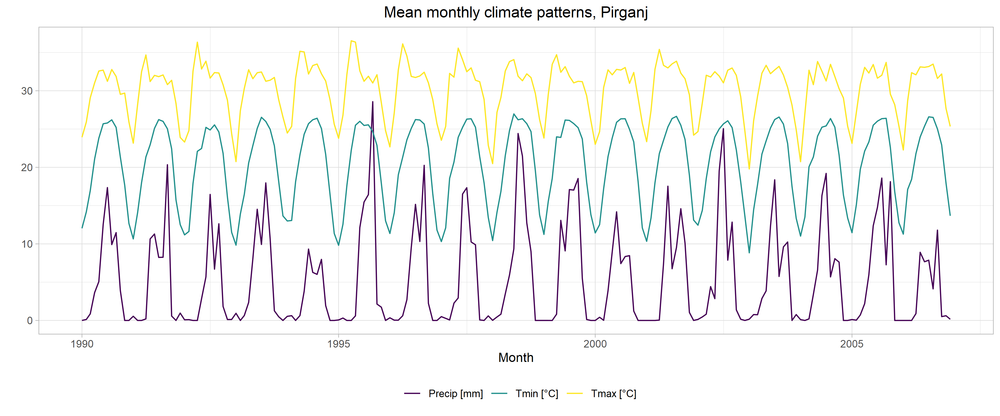<!-- -->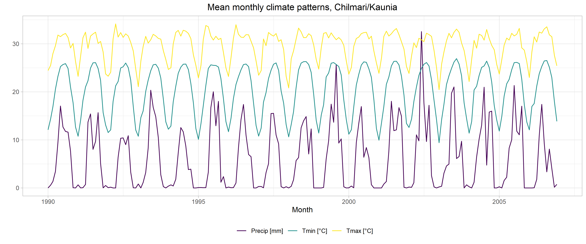<!-- -->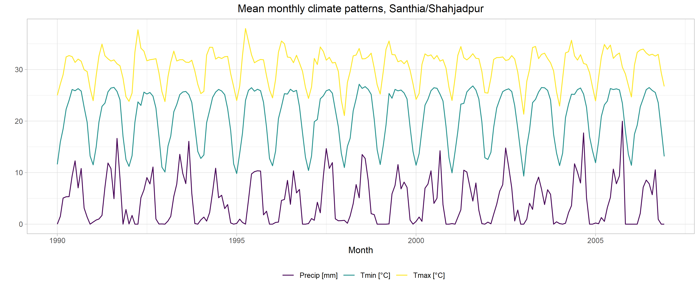<!-- -->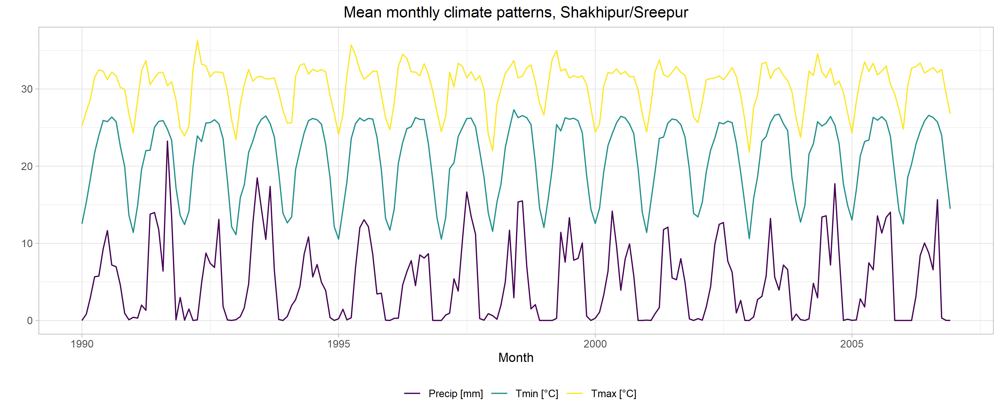<!-- -->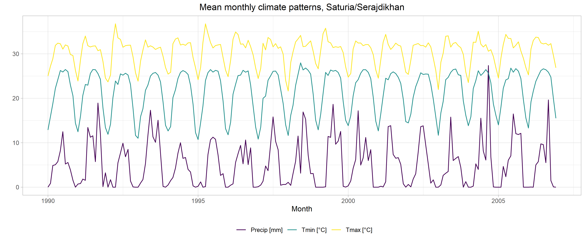<!-- -->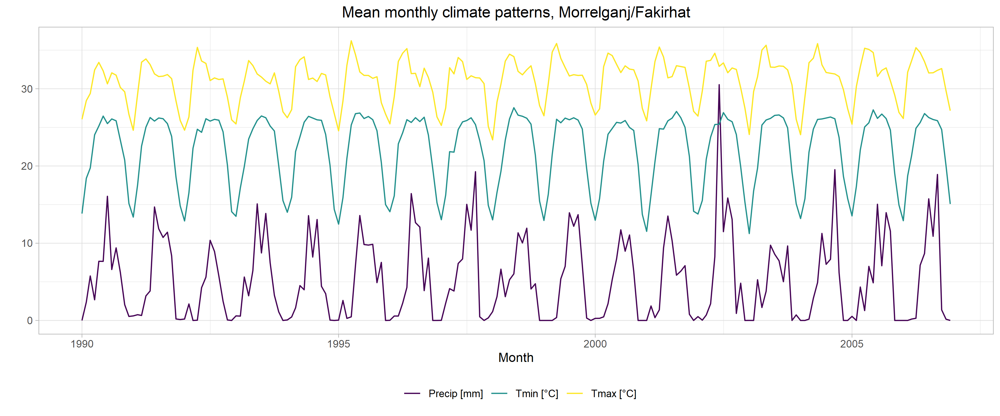<!-- -->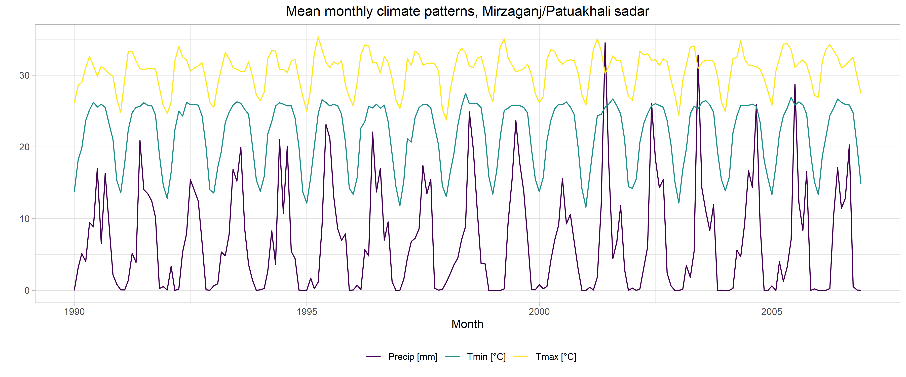<!-- -->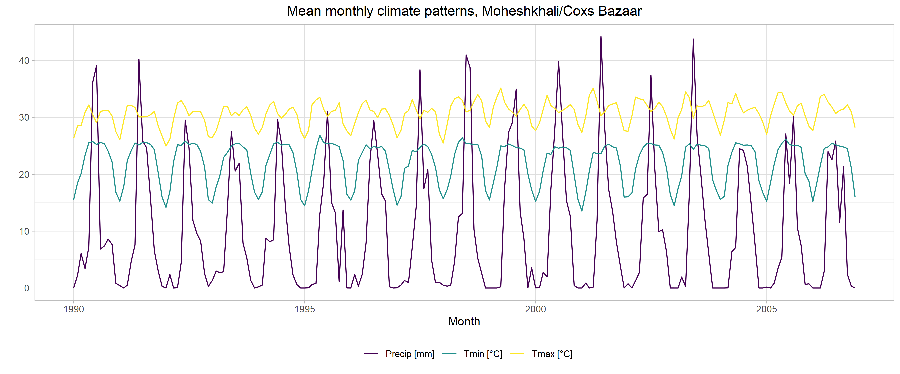<!-- -->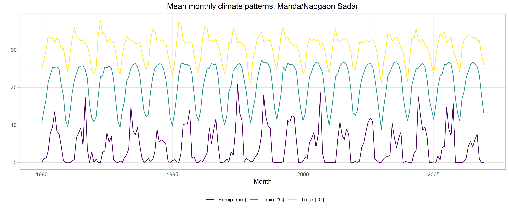<!-- -->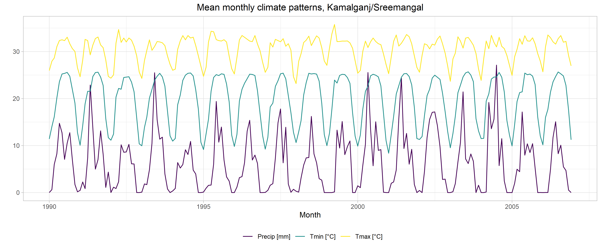<!-- -->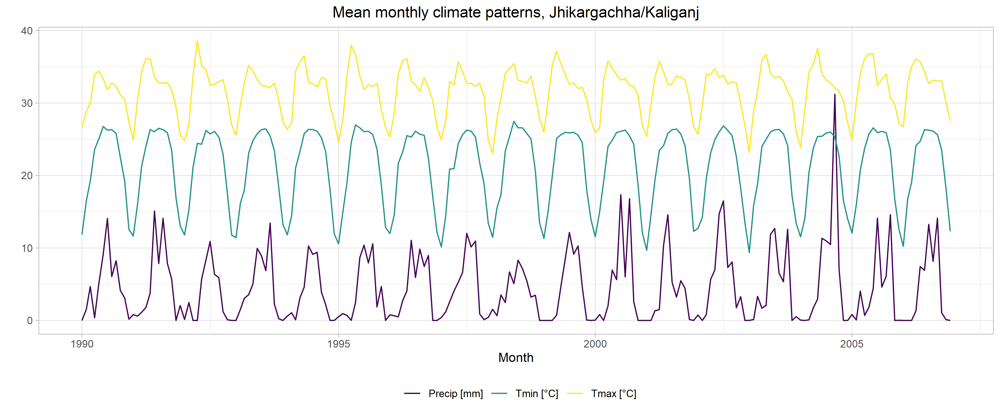<!-- -->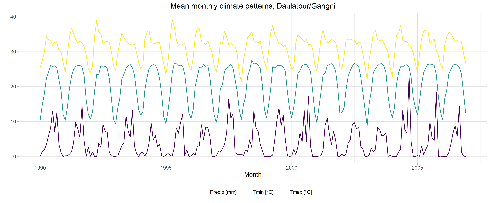<!-- -->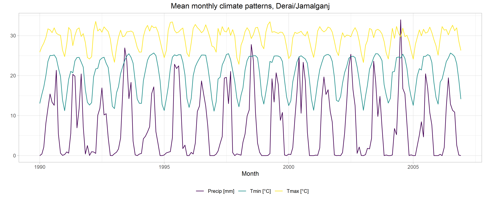<!-- -->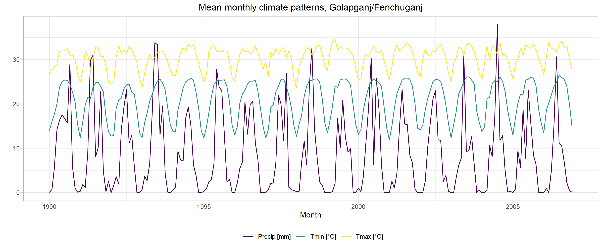<!-- --><!-- -->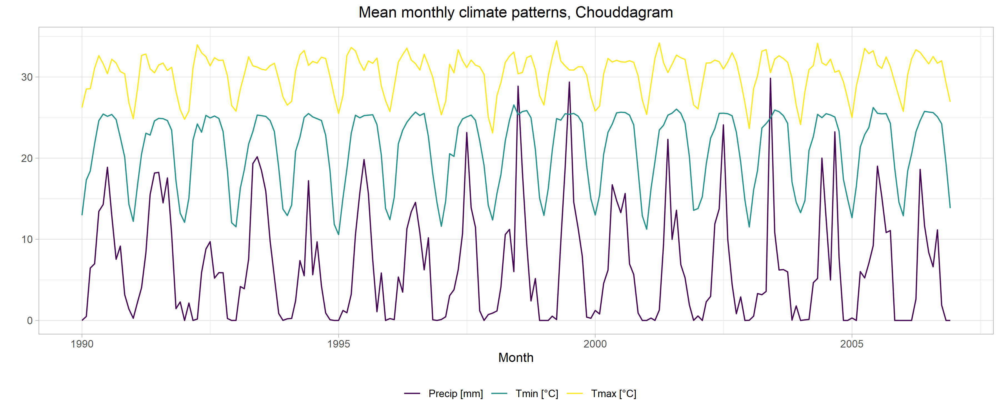<!-- -->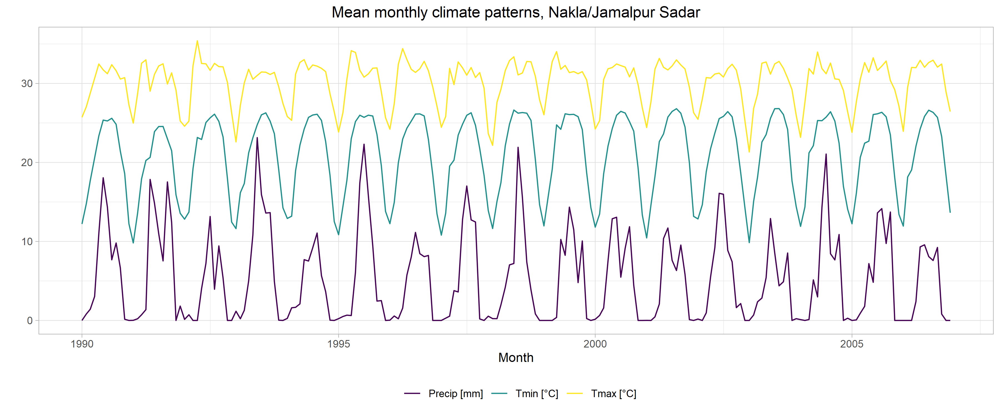<!-- -->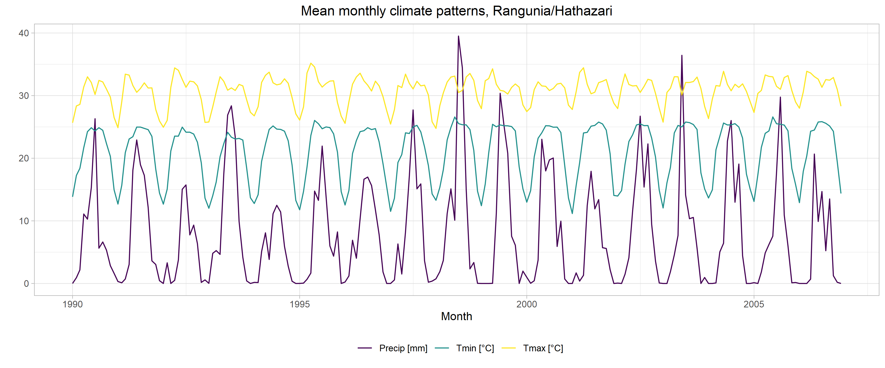<!-- -->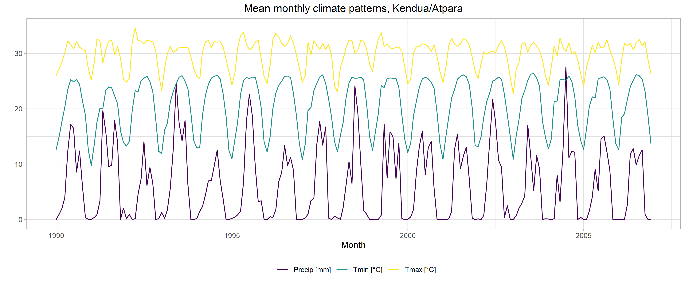<!-- -->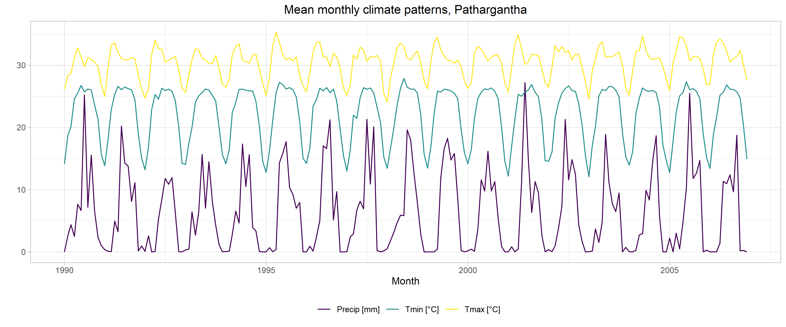<!-- -->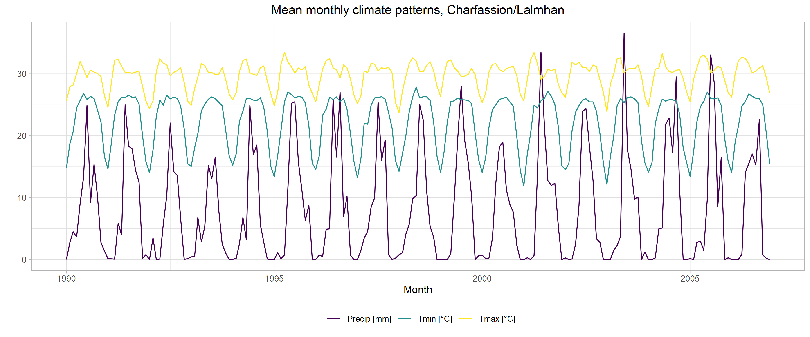<!-- -->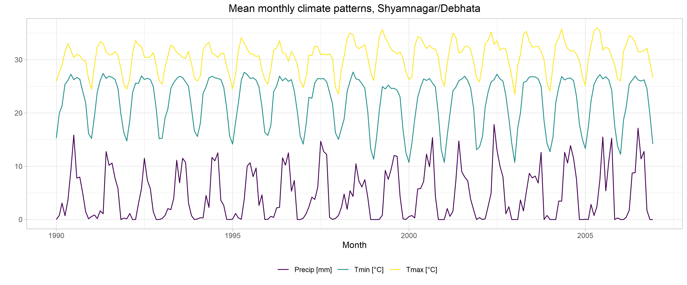<!-- -->
