Descriptive Plots by Area: NSP, 1990-2006
================
Will Simmons

    ## -- Attaching packages ---------------------------------------------------------------------------------------------- tidyverse 1.2.1 --

    ## v ggplot2 3.2.1     v purrr   0.3.3
    ## v tibble  2.1.3     v dplyr   0.8.3
    ## v tidyr   1.0.0     v stringr 1.4.0
    ## v readr   1.3.1     v forcats 0.4.0

    ## -- Conflicts ------------------------------------------------------------------------------------------------- tidyverse_conflicts() --
    ## x dplyr::filter() masks stats::filter()
    ## x dplyr::lag()    masks stats::lag()

#### Importing and cleaning data

``` r
nsp = read_excel('./data/nsp_subset_datechanged.xlsx') %>% 
  select(-rd, -thana, -union, -vill, -para, -match_quality, -year) %>% 
  mutate(dov = as.Date(dov), ## converting POSIXct to Date
         surv_area = as.ordered(surv_area), 
         area_name = as.factor(area_name),
         area_name = forcats::fct_reorder(area_name, as.numeric(surv_area)), ## area_name is factor ordered by surv_area
         zwfl = as.numeric(zwfl), ## NAs will be introduced by coercion
         zlen = as.numeric(zlen),
         zwei = as.numeric(zwei),
         ageindays = as.numeric(ageindays)
  ) 
```

#### Table of survey area number by area name

| surv\_area | area\_name                 |
| ---------: | :------------------------- |
|          1 | Dhaka slum                 |
|          2 | Khulna slum                |
|          3 | Chittagong slum            |
|          4 | Pirganj                    |
|          5 | Chilmari/Kaunia            |
|          6 | Santhia/Shahjadpur         |
|          7 | Shakhipur/Sreepur          |
|          8 | Saturia/Serajdikhan        |
|          9 | Morrelganj/Fakirhat        |
|         10 | Mirzaganj/Patuakhali sadar |
|         11 | Moheshkhali/Coxs Bazaar    |
|         12 | Manda/Naogaon Sadar        |
|         13 | Kamalganj/Sreemangal       |
|         14 | Jhikargachha/Kaliganj      |
|         15 | Daulatpur/Gangni           |
|         16 | Derai/Jamalganj            |
|         17 | Golapganj/Fenchuganj       |
|         18 | Sarail/Nabinagar           |
|         19 | Chouddagram                |
|         20 | Nakla/Jamalpur Sadar       |
|         21 | Rangunia/Hathazari         |
|         22 | Kendua/Atpara              |
|         23 | Pathargantha               |
|         24 | Charfassion/Lalmhan        |
|         25 | Shyamnagar/Debhata         |

#### Survey frequency by time and area

``` r
nsp %>% 
  ggplot(aes(x = dov, y = zwfl)) +
  geom_point(size = 0.01) +
  facet_wrap(. ~ area_name, ncol = 5) +
  xlim(as.Date("1990-01-01"), as.Date("2006-12-31"))
```

    ## Warning: Removed 14632 rows containing missing values (geom_point).

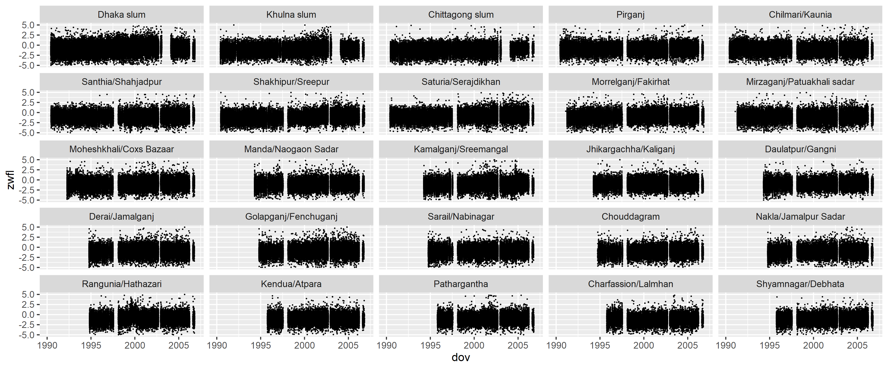<!-- -->

``` r
## plotting function
plot_zwfl_timeseries = function(area) {
  
  nsp %>% 
    filter(surv_area == area) %>% 
    ggplot(aes(x = dov, y = zwfl)) +
    geom_point(size = 0.01) +
    xlim(as.Date("1990-01-01"), as.Date("2006-12-31")) +
    labs(y = "Weight-for-length Z-score",
         x = "Day",
         title = area_names[[area,2]]) +
    theme_light() +
    theme(plot.title = element_text(hjust = 0.5))
  
}


## plot one area
#  plot_zwfl_timeseries("1")


# plot the rest
for (i in 1:25) {
  
  f = plot_zwfl_timeseries(i)
  print(f)
  
}
```

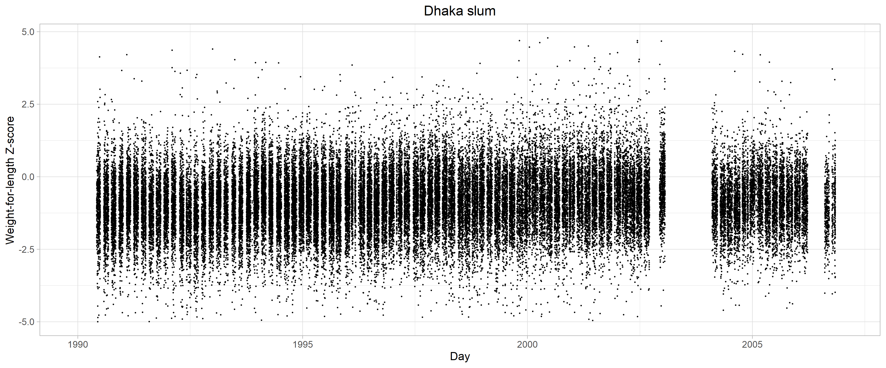<!-- -->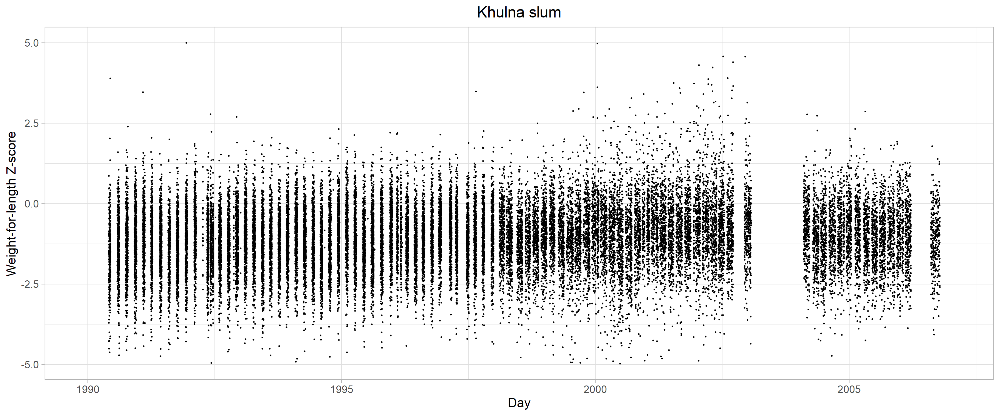<!-- -->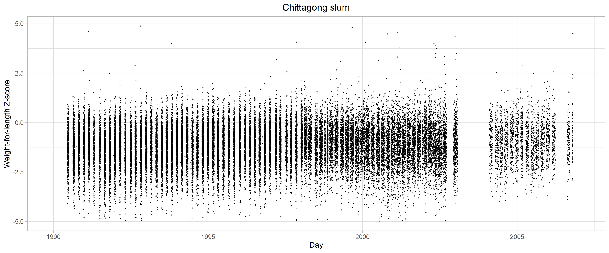<!-- -->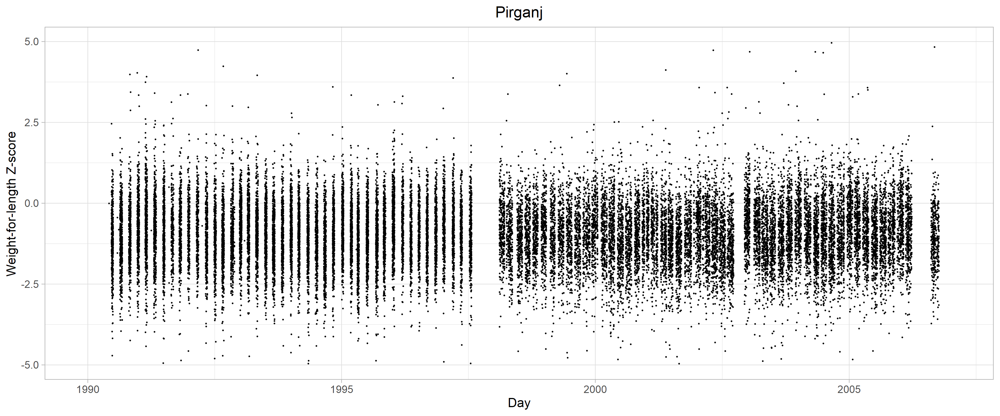<!-- -->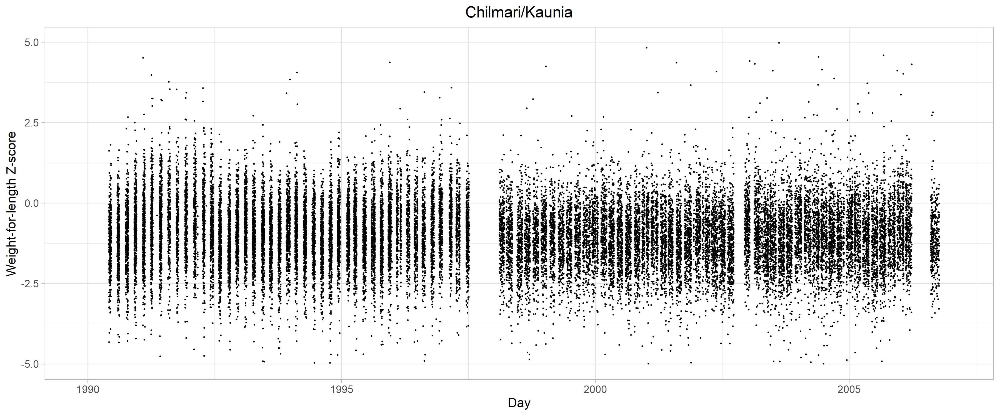<!-- -->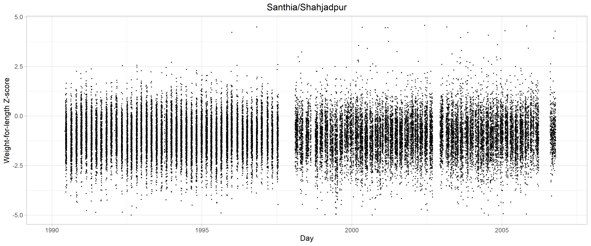<!-- -->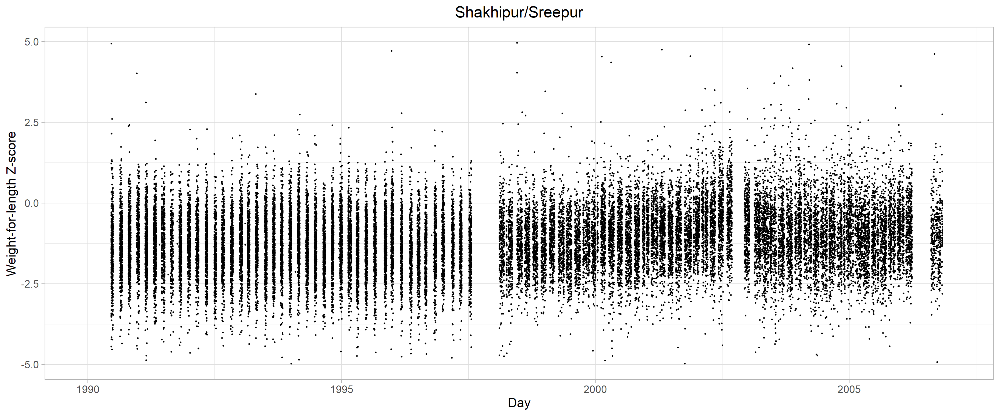<!-- -->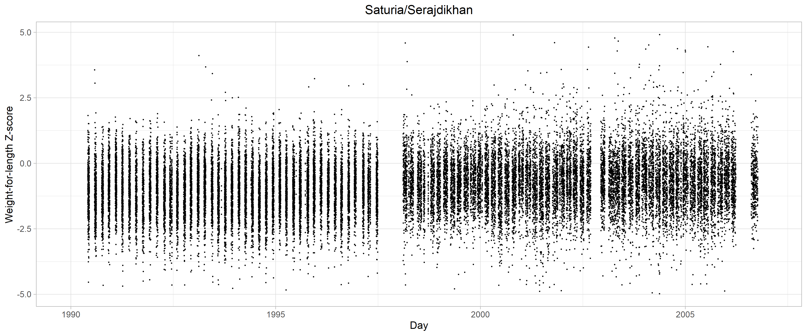<!-- -->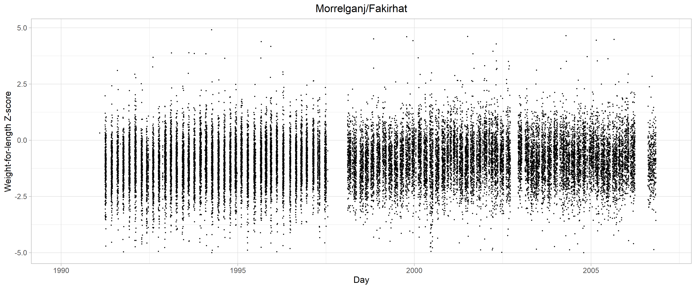<!-- -->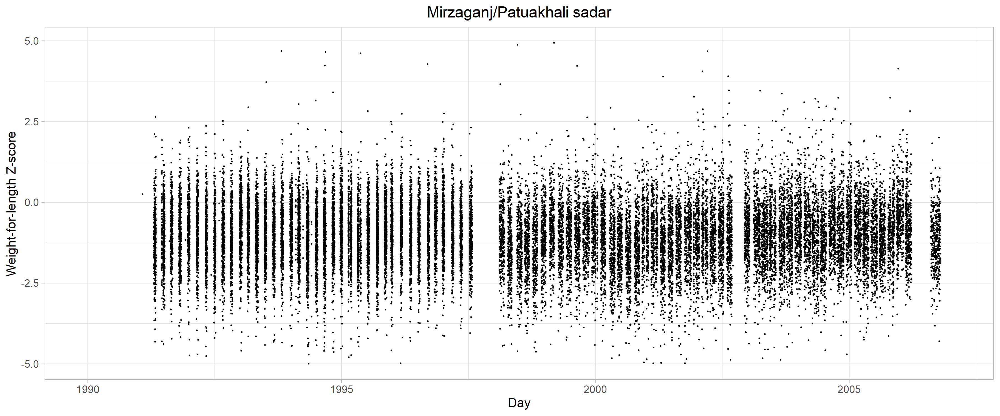<!-- -->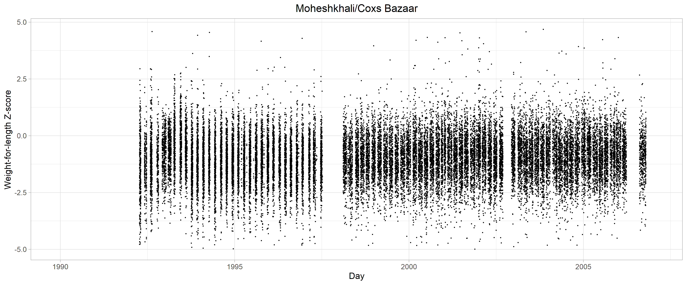<!-- -->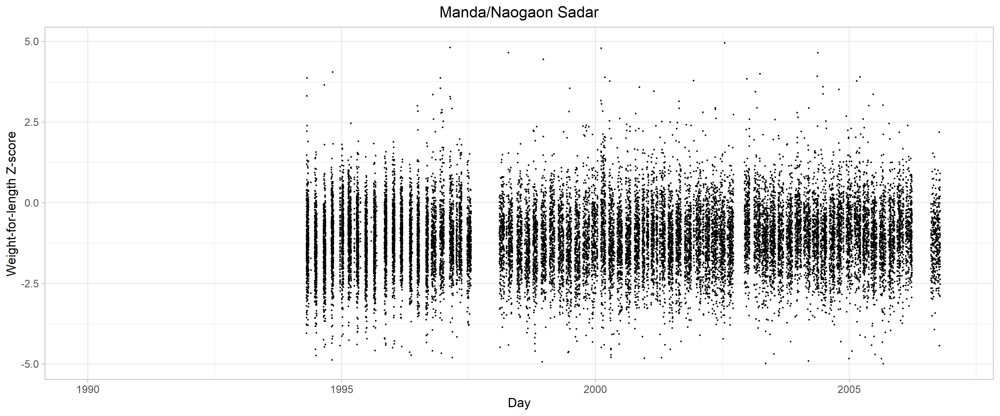<!-- -->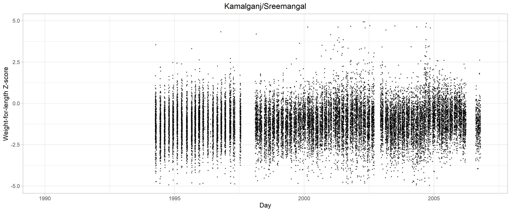<!-- --><!-- -->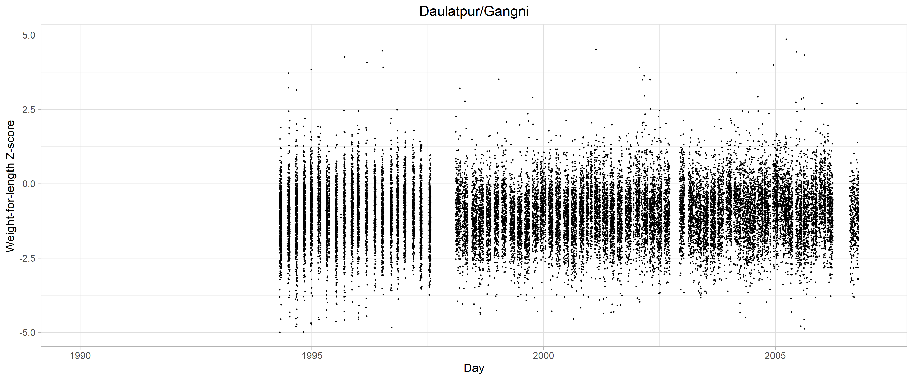<!-- -->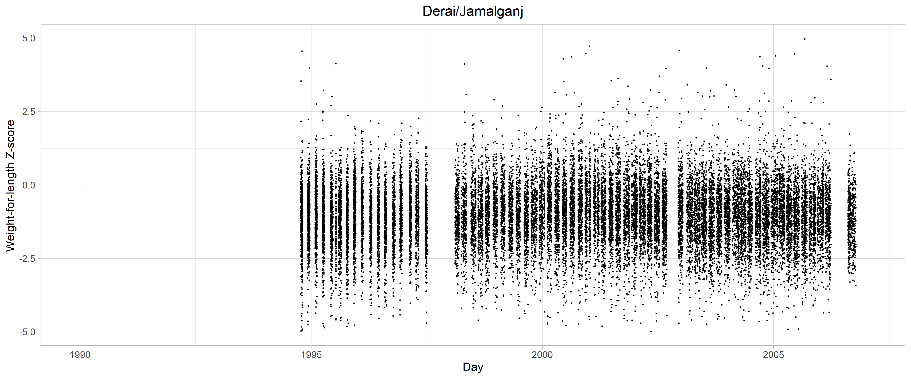<!-- --><!-- -->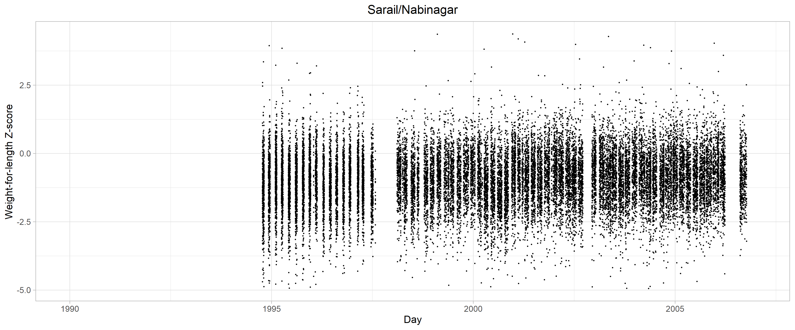<!-- -->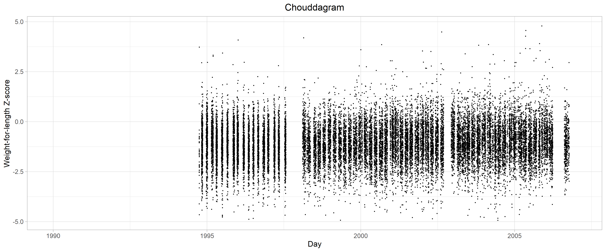<!-- -->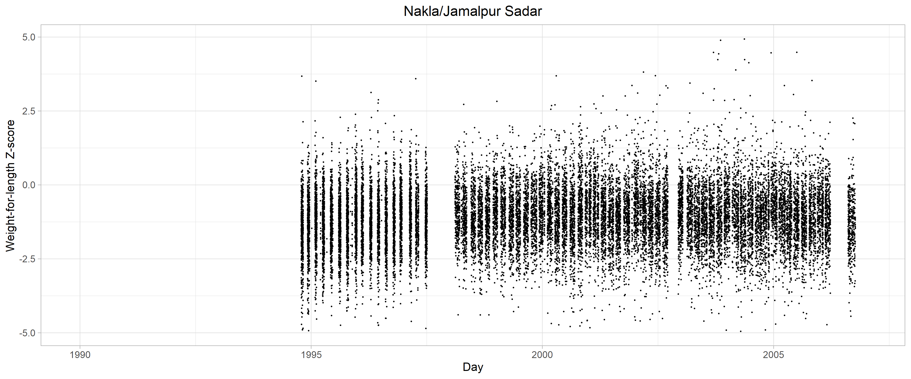<!-- -->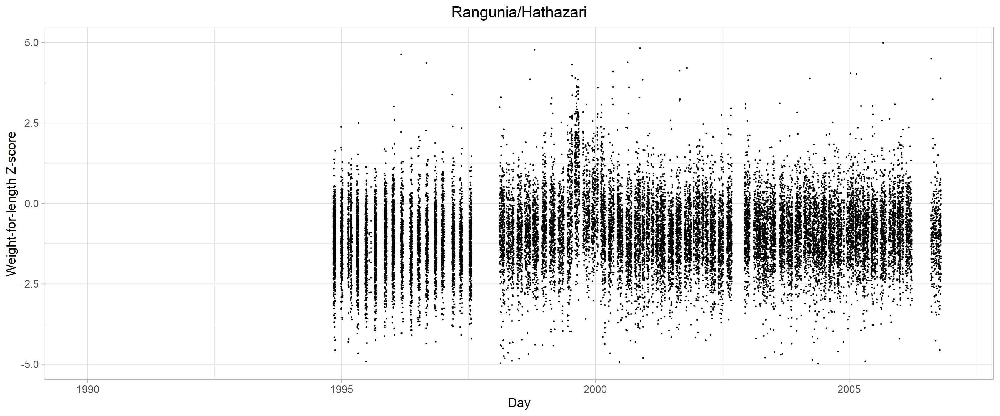<!-- --><!-- -->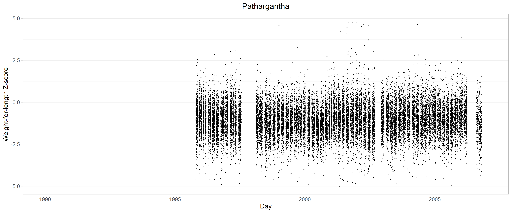<!-- -->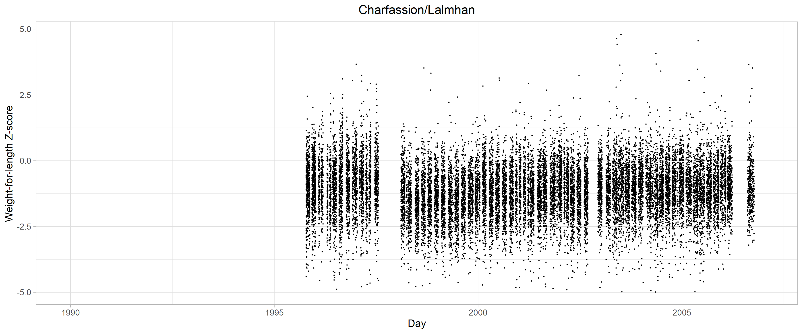<!-- --><!-- -->
